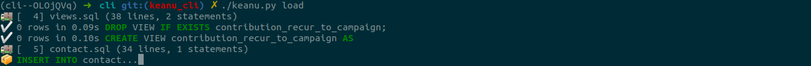

# Project Keanu

Project Keanu constist of:
- Handbook for analytic terms, metrics and their definitions
- Common data model for campaign evaluation
- Set of queries to visualize metrics and key indicators
- ETL tool to transform data in CRM (Currently CiviCRM, Identity in the future)
- Metabase setup tool (mainly import/export of questions, dashboards) 


# Keanu CLI

Keanu command lives in `cli` directory. It can (incrementally) load data from CiviCRM to keanu schema and delete it. With this functionality you can develop ETL SQL scripts with ease of rewinding and forwarding the state of keanu DB. 



## Setup

1. Install Pipenv command in your system: `sudo apt install pipenv`
2. Install dependencies in `cli` directory: `pipenv install`

## Configuration

1. Copy the `.env.sample` file to `.env` and change it to taste. 

- `DATABASE_URL` - must use schema understood by SQLAlchemy library. 
- `SOURCE` - is a name of CiviCRM database (also called schema)

## Usage

Keanu commands has a set of subcommands, similar to git or heroku.
You need to enable the Pipenv, by running `pipenv shell`.

### schema: manipulating database schema

- `./keanu schema -L filename` - loads SQL schema file.
- `./keanu schema -D` - drops all tables from the database.

### load: loading data

`./keanu.py load` loads data from CiviCRM to keanu db in ordered steps. Every SQL file in `sql` directory has `-- ORDER: 12` comment which specifies an order. The default order is 100.

Options:

- `-o 10` - _order_, start from SQL file with order 10
- `-s` - _single_, run just one SQL file and exit
- `-n` - _dry run_, do not execute the SQL. Usefull to see the order of scripts
- `-i` - _incremental_, also run the incremental parts of the SQL, normally deleted (they are marked by `-- BEGIN INCREMENTAL` and `-- END INCREMENTAL` comments)
- `-d` - _display_ a whole SQL statement instead of abbreviation of first line

### delete: deleting data

`./keanu.py delete` will go through the SQL scripts in _reverse order_ and execute the commented `DELETE` and `TRUNCATE` statements in the scripts. 

Options:

- `-n` - _dry run_, do not execute the SQL. Usefull to see the order of scripts
- `-o 10` - delete data until the SQL file _order_ (inclusive) and stop
- `-s` - _single_, run just one SQL file and exit
- `-d` - _display_ a whole SQL statement instead of abbreviation of first line


### SQL file reference:

We add metadata to SQL files in SQL comments. This is usefull because you can still work with the SQL files using tools like MySQL Workbench, or mysql command - the commands will be ignored.

Supported commands are:

`-- ORDER: arg` - arg should be a 3 digit number. It specifies the order this script will be run.
`-- DELETE FROM .. ` - a DELETE statement will be saved to revert this script, so to remove all the data it has added. Must start with all caps DELETE.
`-- TRUNCATE` - similar to above. Please note: TRUNCATE will fail if any other table has reference to this table, even when it's empty.
`-- IGNORE` - the rest of the file will be ignored.

Blocks are also supported. They are marked by a pair of lines: 

```sql
-- BEGIN keyword
 .. some SQL code here..
-- END keyword
```

They should be properly nested.

Supported blocks are:
- `BEGIN INCREMENTAL` / `END INCREMENTAL` - marks part of the SQL that will normally be removed, and will be only used if `-i` (incremental flag) is used while loading. You can have many INCREMENTAL blocks. Example use:

```sql
-- this scripts inserts into cookie jar
-- ORDER: 10
-- DELETE FROM jar

INSERT INTO jar (colour, size, external_id)
SELECT
  cd.name, 
  c.size,
  c.id
FROM cookie c
JOIN colour_dictionary cd ON c.colour_id = cd.id

-- when we do incremental, we exclude external_id's we already have:
-- BEGIN INCREMENTAL
WHERE c.id NOT IN (SELECT external_id FROM jar)
-- END INCREMENTAL

```

- `BEGIN INITIAL` / `END INITIAL` - marks part of the SQL that will be removed in incremental `-i` mode.

Enviroment variable interpolation. Similar to shell, simple variable interpolation is supported. `${FOO}` will be interpolated into value of FOO environment variable. This is currently used to insert the source schema name with `${SOURCE}`.

## Product vision

Right now during initial development, we run keanu command from the source
directory `cli`, and the SQL scripts are kept in `sql`. The vision for the
future product is the following:

Keanu will be a command installed gloablly into the system, with `pip install
keanu`. It will work like git or heroku, a multi-tool to do everything
conntected to common DB model, ETL, running AI logic, installing dashboards in
Metabase (this last function fits this command least, but let's see).

It will download a repository of SQL files, properly divided between general
use, CiviCRM users, Identity users, etc, and be able to configure itself with
`keanu setup` - saving information about source and target DBs. It will be able
also to upload SQL files that were changed and verion manage them somehow, to
help in collaboration (this could be done using git).

Similarly, it will enable import and export of Metabase questions (called
__cards_) and dashboards. Not only their SQL, but also their JSON configuration
(using [python Metabase API client
library](https://github.com/stunitas/metabase-py)).

