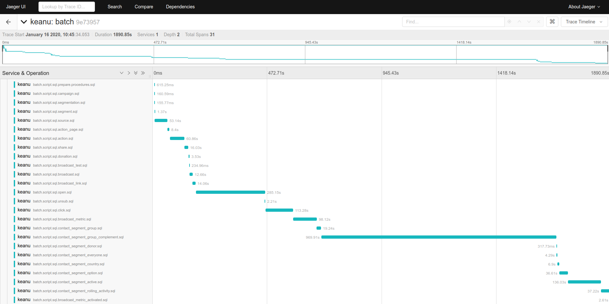

# Measuring runtime

Keanu uses Jeager metrics to send batch execution times to [Jaeger](https://www.jaegertracing.io/).

To configure, set environment variable to host running Jaeger (can be in `.env`):
```
JAEGER_AGENT_HOST=bog4.cahoots.pl
```

This can be localhost ([you can run Jaeger using docker with zero configuration](https://www.jaegertracing.io/docs/1.16/getting-started/)), or instance I have set up.

You can see metrics on HTTP port 16686. For my instance it's http://bog4.cahoots.pl:16686/


## Metrics



Keanu sends metrics for scoped jobs called _spans_. Each span has a set of tags that you can search throught.

Currently measured spans are:

1. Batch
   tags:
   - mode: load | delete
   - incremental: true | false
   - user: running user
   
2. Script
   tags:
   - incremental: true | false
   - source_name: name of source as defined in yaml file
   - destination_name: name of destination as defined in yaml file
   - user: running user
   
